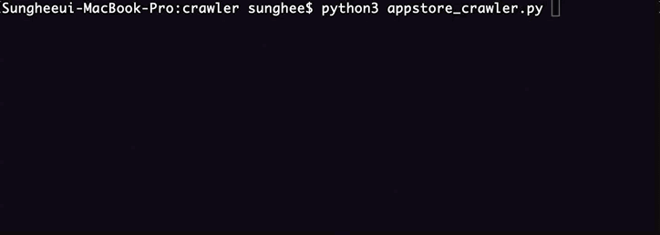
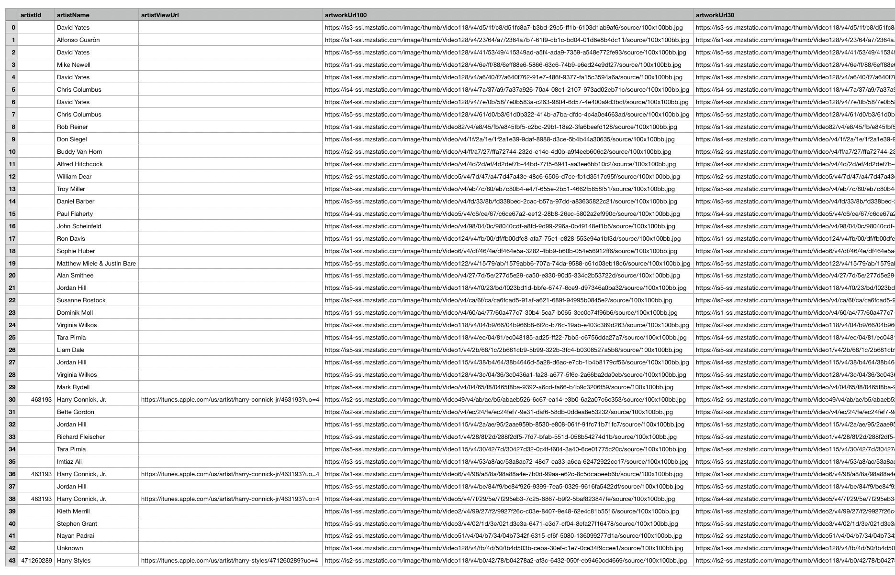

# iTunes-crawler

### Requirements

- Python 3

### Getting Started

**Run** `python3 appstore_cralwer.py`

1. Enter a word to search for

2. Enter the number of the type of results you want returnd ex) 1

   1.movie 2.podcast 3.musicVideo 4.audiobook 5.shortFilm 6.tvShow 7.software(app) 8.ebook 9.all

3. Enter the two-letter country code for the store you want to search

   > See [http://en.wikipedia.org/wiki/ ISO_3166-1_alpha-2](http://en.wikipedia.org/wiki/%20ISO_3166-1_alpha-2) for a list of ISO Country Codes.

### Result

fieldnames in a file

```
- advisories
- appletvScreenshotUrls
- artistId
- artistName : The name of the artist returned by the search request.
- artistViewUrl
- artworkUrl100 : A URL for the artwork associated with the returned media type, sized to 100×100 pixels.
- artworkUrl512 : 512×512 pixels
- artworkUrl60 : 60×60 pixels
- averageUserRating
- averageUserRatingForCurrentVersion
- bundleId
- contentAdvisoryRating
- currency
- currentVersionReleaseDate
- description
- features
- fileSizeBytes
- formattedPrice
- genreIds
- genres
- ipadScreenshotUrls
- isGameCenterEnabled
- isVppDeviceBasedLicensingEnabled
- kind : The kind of content returned by the search request.
- languageCodesISO2A
- minimumOsVersion
- price
- primaryGenreId
- primaryGenreName
- releaseDate
- releaseNotes
- screenshotUrls
- sellerName
- sellerUrl
- supportedDevices
- trackCensoredName : The name of the album, TV season, audiobook, and so on returned by the search request, with objectionable words *’d out.Note: Artist names are never censored.
- trackContentRating
- trackId
- trackName : The name of the track, song, video, TV episode, and so on returned by the search request.
- trackViewUrl : A URL for the content associated with the returned media type. You can click the URL to view the content in the iTunes Store.
- userRatingCount
- userRatingCountForCurrentVersion
- version
- wrapperType : The name of the object returned by the search request.
```

### Screenshots

##### running



##### result(csv file)



<br/>

### Todo List

##### 19-03-21

> apple app store 홈페이지(itunes preview)에서 모든 앱은 크롤링 할 수 있지만 검색기능 없음(x)
>
> itunes search api있음(https://affiliate.itunes.apple.com/resources/documentation/itunes-store-web-service-search-api/) -> 하지만 200개 제한
>
> 그래서 ios앱 검색해주는 https://fnd.io/#/ 이곳을 사용할까함.. 하지만 최신 앱들이 반영되어있는지 모르겠음,,
>
> -> 검색해보니 내가 하고자하는 검색어는 200개를 넘기지 않음,, 그래서 그냥 api사용. (또 대부분의 결과들이 200개를 넘어가지 않음)
>
> 그리고 위의 사이트도 뜯어보니 api를 이용해서 한계가 있었음.

> attribute 안주면  column은 아래와 같이 있음.
>
> ['advisories', 'appletvScreenshotUrls', 'artistId', 'artistName', 'artistViewUrl', 'artworkUrl100', 'artworkUrl512', 'artworkUrl60', 'averageUserRating', 'averageUserRatingForCurrentVersion', 'bundleId', 'contentAdvisoryRating', 'currency', 'currentVersionReleaseDate', 'description', 'features', 'fileSizeBytes', 'formattedPrice', 'genreIds', 'genres', 'ipadScreenshotUrls', 'isGameCenterEnabled', 'isVppDeviceBasedLicensingEnabled', 'kind', 'languageCodesISO2A', 'minimumOsVersion', 'price', 'primaryGenreId', 'primaryGenreName', 'releaseDate', 'releaseNotes', 'screenshotUrls', 'sellerName', 'sellerUrl', 'supportedDevices', 'trackCensoredName', 'trackContentRating', 'trackId', 'trackName', 'trackViewUrl', 'userRatingCount', 'userRatingCountForCurrentVersion', 'version', 'wrapperType']
>
> 여기서 우리가 필요한 것은 크게 두 가지
>
> 1. trackName: 앱 이름
> 2. description: 앱 설명

> 생각보다 너무 빨리 끝남.. 이왕 앱스토어 한 거 아이튠즈로 바꿔보자..
>
> 시간 남으면 input이 아니라  - - 로 바로 할 수 있도록 바꾸자..